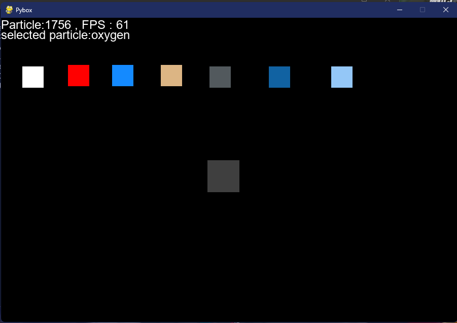
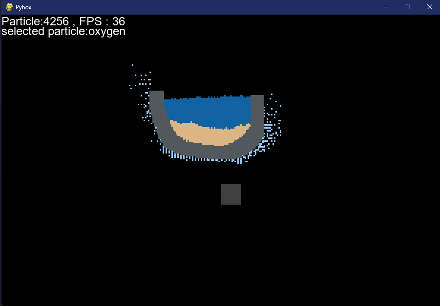
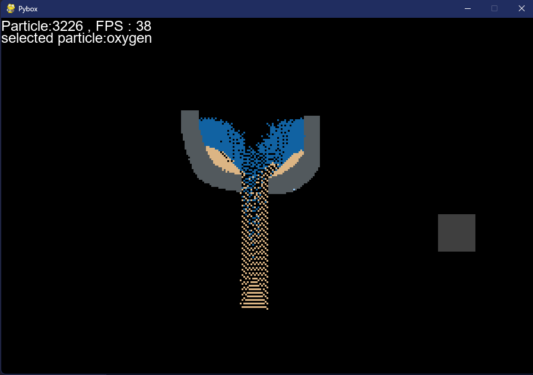

# PYBOX

A 2d physic based sandbox backbone made with python and pygame. This game provides 5 particle classes so far those are

* Nuclear
* Powder
* Solid
* Liquid
* Gas

Currently there is 1 reaction. But you can add more if you want to with the collision and spawn system. 

## Controls

* Tab - Change partcile
* Shift  - Change brush size
* Space - Stop time
* R - Clear canvas
* 1 - Draw horizontal grids
* 2 - Draw verticle grids
* G - Draw particle in grids

### SCREENSHOTS

#### TEST REACTION

1. Electron + Proton = Neutron

Made By aybenmila
